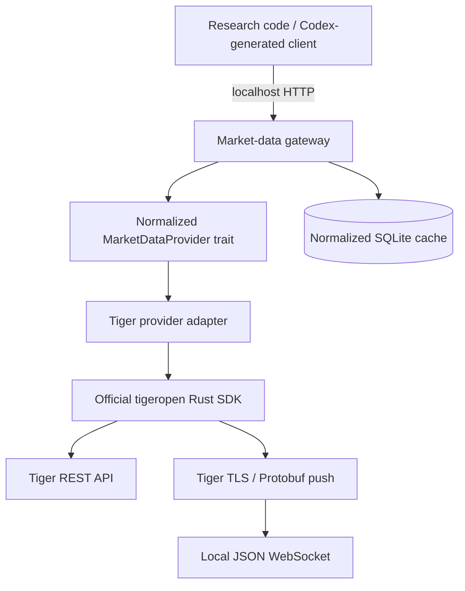

# Architecture

The official `tigeropen` crate owns signing, token loading, HTTP transport,
response parsing, and the persistent real-time connection. The adapter translates
Tiger types into provider-neutral models. The gateway never constructs a trade
client and exposes no account or execution routes.

The cache records normalized bars and explicit fetched-range coverage. It does not infer missing holiday observations, currency, timezone, or incomplete-bar status.
