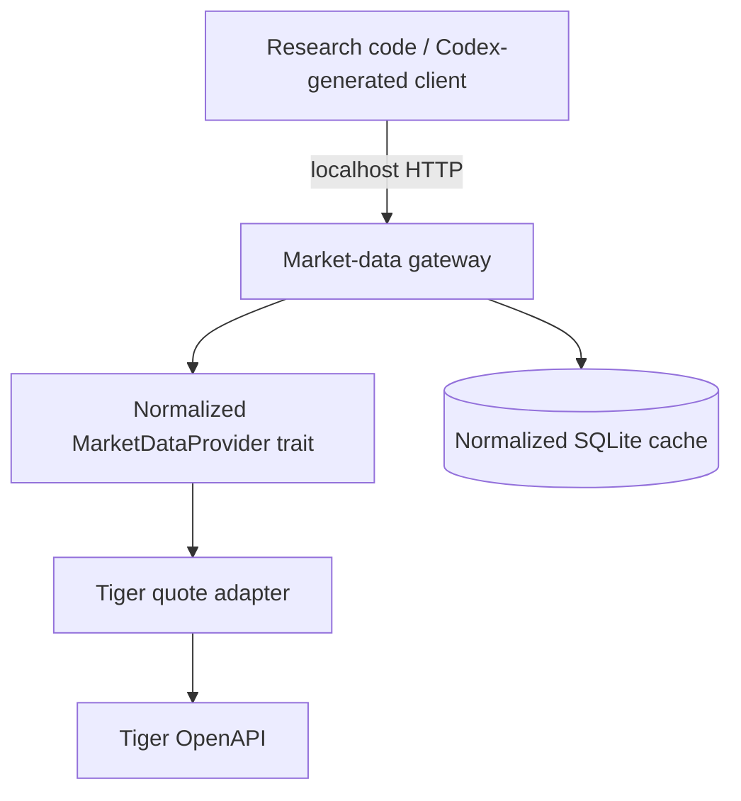

# Architecture

The library owns signing, HTTP transport, and Tiger quote parsing. The adapter is the only translation layer between Tiger JSON and provider-neutral models. The router depends on `MarketDataProvider`, so another provider can be substituted without changing endpoint contracts. The gateway binary has no dependency on `TradeClient`; trade modules exist only behind the `trade` feature.

The cache records normalized bars and explicit fetched-range coverage. It does not infer missing holiday observations, currency, timezone, or incomplete-bar status.
